# Funnel Intelligence — V0 Landscape Findings

**Date:** 2026-06-01
**Author:** Analysis pass (autonomous)
**Data:** `perspective-bi.funnel_intelligence` — `sessions_v2` (275.5M sessions, Jan 2025–May 2026), `versions_v1` (5.7M funnel snapshots)
**Scope:** First exploratory + variance-decomposition pass. Goal: understand what's *possible* with this data for a Funnel Score, and where the signal actually lives — **before** committing to a model.

---

## TL;DR — the 6 things that matter

1. **Baseline is solid.** 4.08% overall CVR, 1.18M funnel versions, 164K campaigns. 99.8% of sessions link to a funnel structure. The data is real and joinable.
2. **The biggest finding: 87% of CVR variance is *between accounts*, only 13% is *within* a funnel across its versions.** Conversion is dominated by who you are (vertical, offer, audience, traffic) — not how you build the page. **The designable signal is the 13%.** This makes *percentile-within-vertical* (already in the plan) not a nice-to-have but the only honest framing.
3. **Structure does move CVR, monotonically, but weakly per-feature.** Longer funnels convert better (1–3 pages: 1.02% → 21+ pages: 2.73% median). More result/disqualification pages → higher CVR *and* completion. But univariate correlations are ~0.05–0.09 — real direction, small effect against huge account-level noise. The model's job is hard; it will need vertical control + interactions to clear the ρ≥0.4 gate.
4. **There's a concrete A/B prize.** Within a single campaign (same offer/audience/vertical), the **best version converts 1.46× the median version**. That's the controllable upside, and it's exactly what an A/B intelligence layer would chase.
5. **🚩 The drop-off signal is broken.** `counter.highest` / `counter.processed` do *not* track step progression: 97.7% of sessions show `highest=1` with an empty `processed` array, and those are the converters. Step-navigators convert at ~0%. **Per-step drop-off analysis is blocked** until we either decode these fields or load the `activities` collection (Phase 2). Don't build diagnostics on this field.
6. **Two data-quality fixes already done/needed.** `versions_v1` had 33% duplicate `_id`s (deduped → `versions_dedup_v1`). `cookieOverlay.language` extraction is near-empty (only 2 distinct values) — vertical/language tagging needs a real source.

---

## 1. The landscape

| Metric | Value |
|---|---|
| Sessions (Jan 2025–May 2026) | 275,489,376 |
| Overall CVR (`ps_converted_at IS NOT NULL`) | **4.08%** |
| Distinct funnel versions | 1,182,887 |
| Distinct campaigns | 164,281 |
| Session→version link coverage | 99.84% |

**Traffic is long-tailed.** Only 9% of funnels have ≥500 visitors, but they hold 82% of traffic. ~55K funnels have ≥1,000 visitors — a healthy labeled training set with reliable CVR.

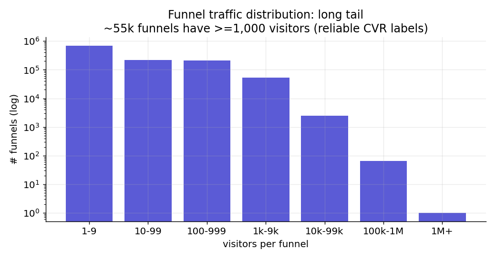

**CVR is heavily right-skewed** (funnels ≥500 visitors): median 2.11%, mean 3.77%, p90 8.87%, p99 27.5%. Log-CVR is the right modeling target (as planned).

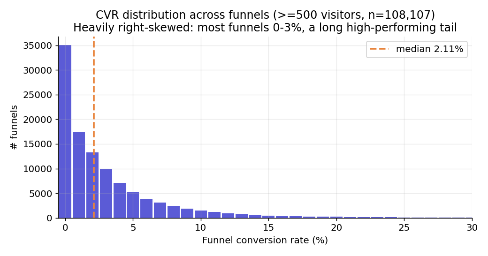

---

## 2. The headline: where conversion variance actually comes from

Among campaigns with ≥2 well-trafficked versions (n=42,492 campaigns, 152K funnels), I decomposed CVR variance into *between-campaign* (different accounts/offers) vs *within-campaign* (same account, different funnel versions):

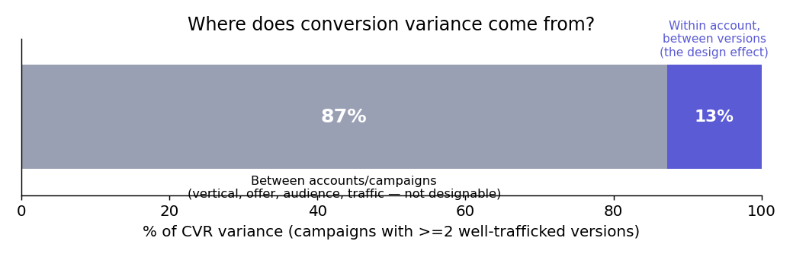

**87% of all variation in conversion is explained at the account/campaign level** — vertical, offer, audience quality, traffic source, brand. A funnel builder editing pages cannot touch this. Only **13%** is the version-to-version design effect.

**Implications:**
- An absolute-CVR Funnel Score ("this funnel will convert at X%") will mostly be predicting the *vertical*, not the design. Useless and gameable.
- **Percentile-within-vertical is mandatory**, not optional. The score must answer "how good is this funnel *for its kind*?"
- The 13% is small but it's the *entire* addressable surface for both the Score and the A/B layer. Everything we build should be measured against that ceiling, not against total CVR.

---

## 3. Structural patterns that move CVR (the Funnel Score seed)

Even within the noisy 13%, clear directional patterns emerge.

**Longer funnels convert better** — monotonic across page count:

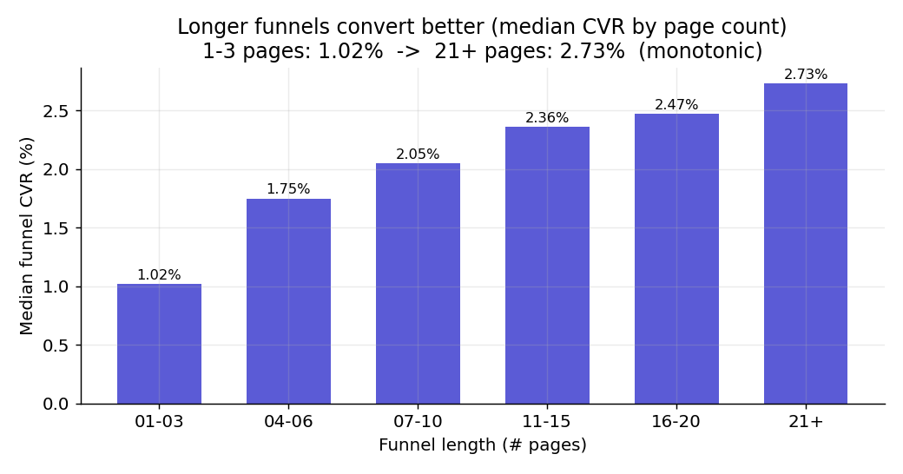

**Branching / disqualification pays off** — more result pages → higher CVR and much higher completion (1 result page: 1.77% CVR / 3.2% completion; 5+: 3.34% / 11.1%):

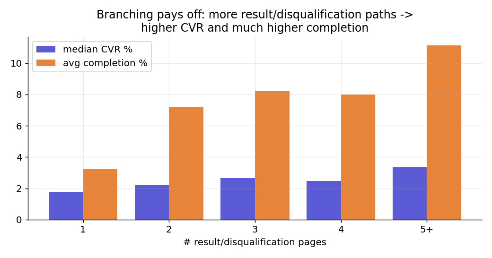

**But per-feature correlations are weak** (vs log-CVR, funnels ≥500 visitors): `n_pages` 0.056, `n_result_pages` 0.091. The bucket trends are real; the per-funnel effect is small against account-level noise. **Takeaway: no single structural feature is a strong predictor. The model must combine many features + control for vertical.** This is consistent with the 87/13 split and sets realistic expectations for the V1 gate.

---

## 4. Traffic source is a major confounder (and a clue)

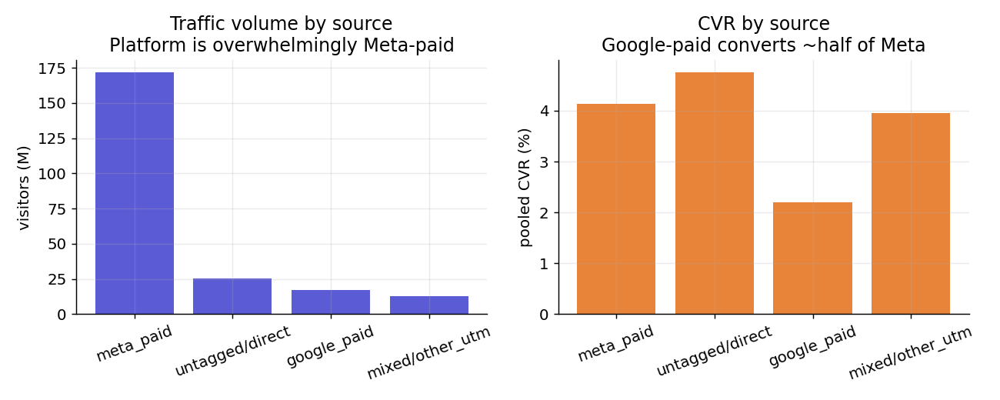

The platform is **overwhelmingly Meta-paid** (172M of 227M classifiable visitors). Google-paid converts at roughly half the rate (2.2% vs 4.1% pooled). Traffic source must be a feature/control in the model — and it hints the product is built around Meta lead funnels.

---

## 5. The A/B prize (and why it's separate from the Score)

Within campaigns that ran ≥3 well-trafficked versions (n=10,230), the **best version converts 1.46× the median version of the same funnel** (median best 3.38% vs median 2.05%). Same vertical, same offer, same audience — pure design delta.

This is the strongest evidence that **a within-funnel A/B intelligence layer has real, measurable headroom**, and it's a *cleaner* problem than the cross-funnel Score because the confounders are held constant by construction.

---

## 6. 🚩 Data quality: the drop-off signal is unusable as-is

I tried to build a per-step retention curve and hit a wall:

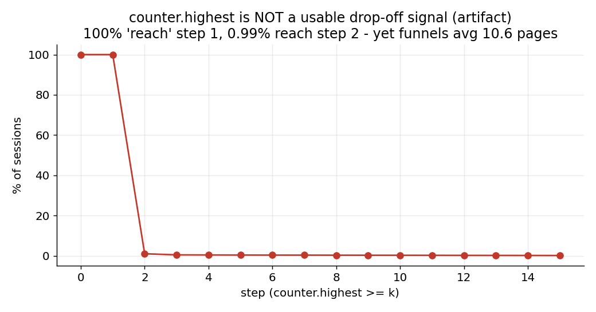

- 97.7% of sessions: `counter.highest = 1`, `counter.processed = []` — **and these are the converters (4.18% CVR)**.
- Sessions that actually navigate steps (`processed` length ≥ 1) convert at **~0%**.
- Yet funnels average **10.6 designed pages** — so this isn't "funnels are one page," it's a tracking artifact.

**Conclusion:** session-level `counter.*` is not a funnel-progression signal. Real per-step drop-off — the backbone of the diagnostics/A/B "what to fix" product — **requires the `activities` collection (~3TB, Phase 2)** or a correct decode of these fields. Flagging now so we don't ship a drop-off chart built on a misread field.

---

## 7. What this means for the roadmap

| Product | Status from this data | Blocker |
|---|---|---|
| **Funnel Score** (structure → percentile-within-vertical) | ✅ Viable now | Need a real **vertical** source (onboarding/HubSpot industry); recursive snapshot feature extraction (question types, copy, theme) |
| **A/B intelligence** (within-funnel "what to improve") | 🟡 Promising (1.46× headroom proven) | Per-step **drop-off** blocked on `activities` / counter decode |
| **Absolute CVR prediction** | ❌ Don't | 87% is account-level — not designable, gameable |

---

## 8. Recommended next steps (in priority order)

**A. Lock the confounders before modeling.**
1. Source a real **vertical/industry** tag per campaign (onboarding `industry` view is broken; try HubSpot `companies.properties_industry` joined via companyId, or derive from funnel copy). This is the #1 blocker for an honest Score.
2. Confirm **traffic-source** features (Meta/Google/untagged) as model controls.

**B. Build the real structural feature set (V1).** Recursive parse of the snapshot `components` tree → question-type mix (media/multiple-choice/form), question count, copy length, theme attributes, edit-count. Join to `funnel_struct_v1`. This is the ~80-feature list from the Notion V1 doc.

**C. First model as a *relative* target.** LightGBM on **CVR-residual-within-vertical** (or rank-within-vertical), not raw log-CVR. Gate: Spearman ρ ≥ 0.4 against held-out within-vertical rank. Read SHAP to confirm it's learning design, not vertical leakage.

**D. Resolve the behavioral data.** Decide: decode `counter.*` (ask the funnels-app team what populates them) vs. scope the `activities` load. The A/B product depends on it.

**E. Hypotheses worth testing together** (interpretable, for trust + the Goodhart "information not commands" framing):
- Does an early-form vs late-form placement change CVR within vertical?
- Optimal funnel length per vertical (the monotonic trend likely saturates/inverts somewhere)?
- Does adding a disqualification branch raise *qualified*-lead CVR?
- Media-question vs text-question funnels, controlling for vertical and traffic?

---

## 9. Vertical from content (added — replaces onboarding survey)

Per your steer, vertical is derived from **what the funnel actually says**, not a self-reported onboarding bucket (which is account-level and stale). Pipeline:
1. JS UDF recursively extracts `text`/`plainText` copy from each snapshot → `funnel_content_v1` (196K funnels, ~3.7K chars each, clean).
2. TF-IDF + KMeans (k=40) clusters funnels by copy → 40 content clusters.
3. Clusters hand-mapped to a 15-label vertical taxonomy → `funnel_vertical_v1`.

**What the data reveals: Perspective is overwhelmingly a German recruiting-funnel platform.** Recruiting = **54.9% of funnels / 102.9M visitors** (apprenticeships, trades, nursing/care, truck drivers, automotive techs, dental staff). Then Services/Consultation (16%), Real Estate (10%), Solar/Energy, Subscription, plus niche high-CVR verticals.

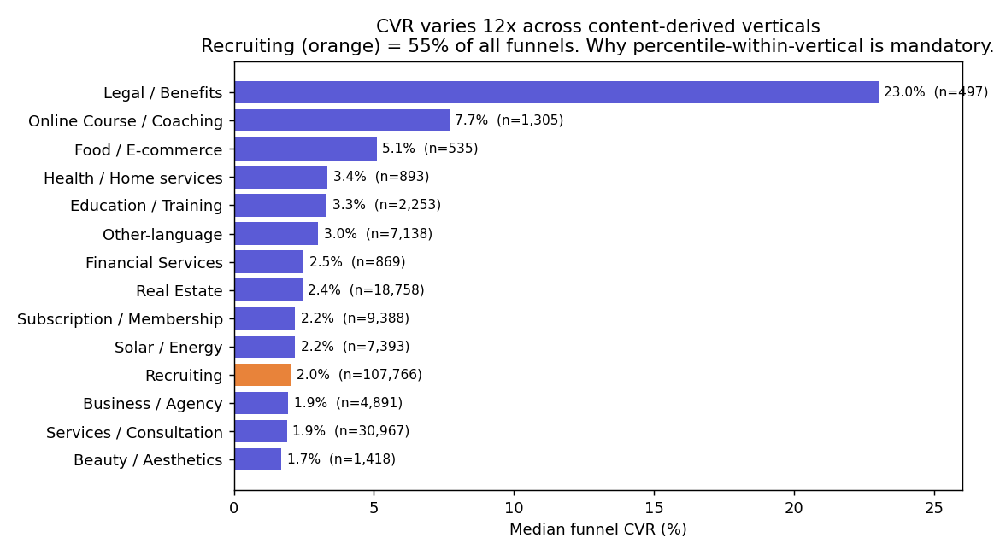

**CVR spans 12× across verticals** (Beauty 1.7% → US Legal/Benefits 23%). This *quantifies* the confounder: an absolute score would mostly rank verticals. Percentile-within-vertical is the only fair score.

**Caveats / next refinement:**
- TF-IDF clusters partly on **language** (separate FR/NL/ES/TR clusters) and **boilerplate** (consent text, FB disclaimers) rather than pure topic. A **multilingual semantic embedding** (e.g. `paraphrase-multilingual-MiniLM`) would cluster by meaning across languages and is the recommended upgrade.
- ~3.6% of funnels are "Other-language" (vertical not yet assignable from terms alone) and ~1.2% are boilerplate "Noise" — both need the embedding pass or a targeted LLM label.
- Currently labeled for funnels ≥200 visitors (196K). Extending to all 1.18M is a cheap re-run once the method is locked.

## 10. Hypothesis 1 tested — low-friction framing (RESULT: conditional, opposite signs by sub-type)

**Hypothesis:** Recruiting funnels promising "apply in seconds / no CV / no cover letter" convert better.
**Method:** Detect low-friction framing in copy (regex over `text`/`plainText`), compare CVR within recruiting sub-type (funnel-level median, Mann-Whitney U). Recruiting funnels ≥500 visitors (n=77,103; 41% framed). Run fully in local pandas (BigQuery had a network outage).

**Verdict: rejected as a universal rule — but real and actionable per sub-type.** Overall: no effect (1.98% vs 1.99%, p=0.56). The average hides two opposite, significant effects:

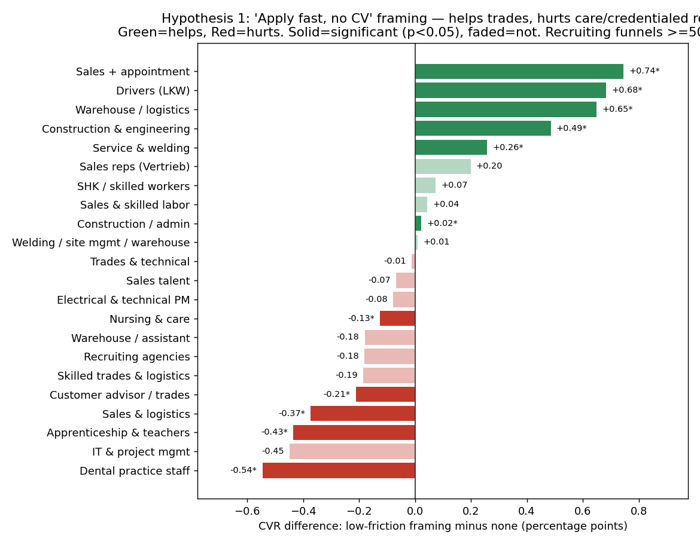

- **Helps (significant):** Sales+appointment +0.74pp, Drivers +0.68pp, Warehouse/logistics +0.65pp, Construction/engineering +0.49pp, Service/welding +0.26pp — *blue-collar, high-volume, lower-commitment roles.*
- **Hurts (significant):** Dental staff −0.54pp, Apprenticeship/teachers −0.43pp, Sales&logistics −0.37pp, Customer advisor −0.21pp, Nursing/care −0.13pp — *credentialed / care / relational roles.*

**Interpretation:** lowering the application barrier drives more conversions where the job is high-turnover and commodity-like, but **backfires for qualified/care roles** — likely attracting unqualified applicants or signalling a low-quality employer. This is direct proof that recommendations must be sub-type-aware; a generic "reduce friction" tip would help some recruiters and hurt others.

**Caveats:**
- Observational (correlational), controlled within sub-type but not yet within-account. The **within-account paired test** (same company running both framed & unframed versions) is the causal strengthener — pending BigQuery network recovery.
- CVR = form submission. It does **not** measure applicant *quality* — which is plausibly the real reason framing backfires for care/credentialed roles. We have no hire-quality label, so that remains a hypothesis.

## 11. Hypothesis 2 tested — optimal funnel length is sub-type-specific (RESULT: confirmed)

**Hypothesis:** the best funnel length differs by recruiting sub-type.
**Method:** CVR vs `n_pages` per sub-type (Spearman + quadratic shape + peak bucket), recruiting funnels ≥500 visitors (n=76,352). Fully local pandas.

**Verdict: confirmed — no universal optimal length, and the direction flips for some niches.**

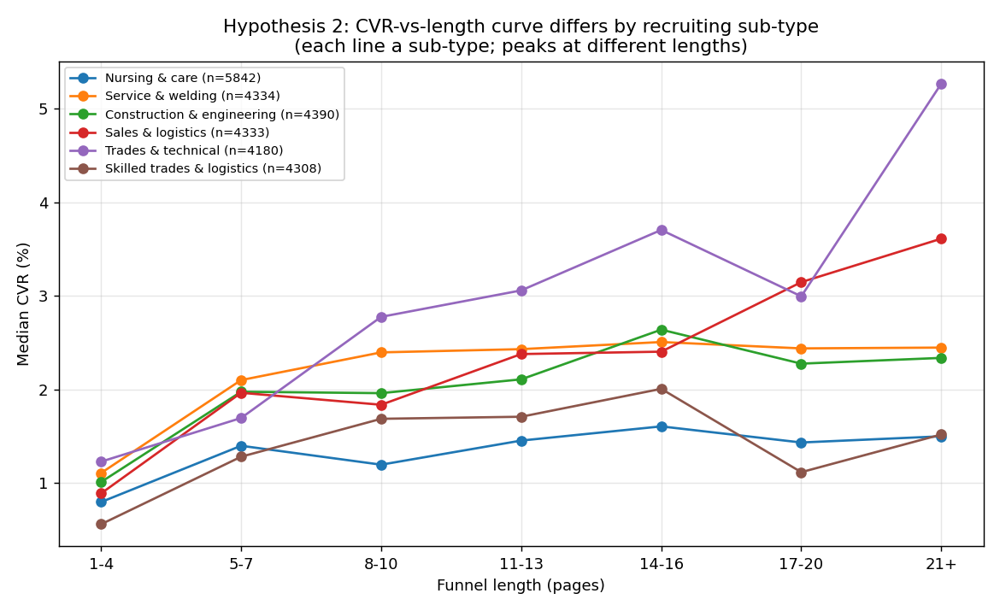

- **Longer is better, keep going (21+ pages):** Trades & technical (median CVR rises to **5.6%** at 21+), Customer advisor (5.8%), Sales & logistics, Recruiting agencies.
- **Plateaus early (~8–10 pages, diminishing returns):** Service & welding (~2.5%), Construction & engineering (~2.6%) — extra pages beyond ~10 add little.
- **Length barely matters / stays low:** Nursing & care (flat ~1.5% regardless of length).
- **Shorter is better — longer HURTS (negative trend):** Dental practice staff (Spearman −0.13, p<0.0001, best at 1–4 pages), Sales reps/Vertrieb (−0.05, best at 1–4).

**Interpretation:** a generic "add more steps" rule would help trades funnels, do nothing for nursing, and *actively hurt* dental and sales-rep funnels. Length guidance must be per sub-type. (Note: dental & nursing prefer *short* funnels here, yet also reacted badly to "apply fast/no CV" framing in H1 — suggesting these niches want concise-but-serious funnels, not gimmicky low-friction ones. Worth a dedicated test.)

**Caveats:** Spearman magnitudes are weak (mostly 0.05–0.15) — length explains little *within* sub-type, consistent with the 87/13 variance split; the directional differences are the actionable part. Observational, controlled within sub-type but not within-account. Significance is driven by large N.

## 12. Engine A first output — per-niche winner-vs-loser contrast (32 niches, 107,690 funnels)

**Method:** within each niche, top CVR quartile vs bottom quartile, compared across 13 structural features (rank-biserial effect, Mann-Whitney, p<0.01 only). Funnels ≥500 visitors.

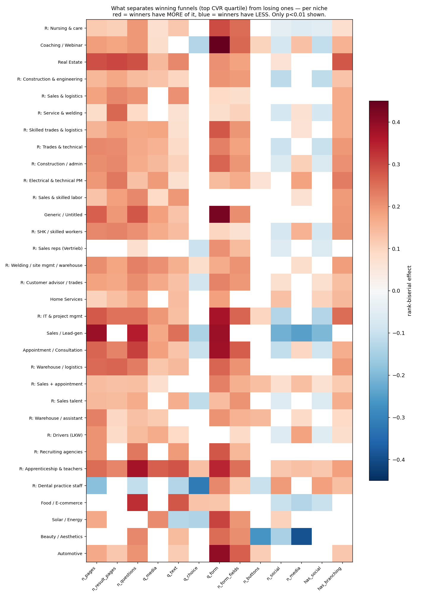

**Three near-universal winner traits (red across almost all 32 niches):**
1. **More form questions** (`q_form` 2→4) — the single most consistent winner trait, significant in ~30/32 niches (strongest: Coaching +0.45, Generic +0.43, Automotive +0.40, IT-recruiting +0.37).
2. **More questions / more pages overall** — winners engage and qualify more (matches H2's direction).
3. **Branching / multiple result pages** — winners use disqualification paths (1→2 result pages).

**The counter-narrative this proves: winners ask MORE, not less.** Top funnels engage harder — more questions, more form fields, longer flows, qualification routing. "Minimize friction" as generic advice is wrong on this platform; *structured engagement* wins. (Consistent with H1: low-friction *framing* also wasn't a universal lever.)

**Niche overrides (the blue cells — where generic advice would backfire):**
- **Beauty/Aesthetics:** winners have far LESS media (−0.39) and FEWER CTAs (−0.26) — clean, focused pages win.
- **Dental practice staff:** winners avoid multiple-choice quizzes (−0.32) and add social proof (+0.19) — trust over gimmicks.
- **Sales/Lead-gen:** winners strip social/media clutter (−0.3) while maximizing length/questions.
- **Drivers (LKW):** winners use MORE media (+0.18) — visual roles want visual funnels. Exact opposite of Beauty.

**Product shape this implies:** global priors ("add qualifying form questions, add branching") + per-niche overrides ("…but in beauty, cut the media clutter"). That's precisely the recommendation table the engine ships.

**Caveats:** observational — "winners ask more" may partly reflect better marketers building richer funnels. Validation path: (a) within-account version comparisons, (b) the `campaign_ab_tests` causal layer. Effects are moderate (0.2–0.45 rank-biserial), as expected given the 87/13 variance split.

## 13. Engine B first output — live drop-off curves (activities, 7-day, 3,265 funnels)

Extracted page-view events per (version, page) from `activities` (the live source, since analyticsPage is legacy), joined to Engine A's page order → per-funnel retention curves → per-niche benchmarks.

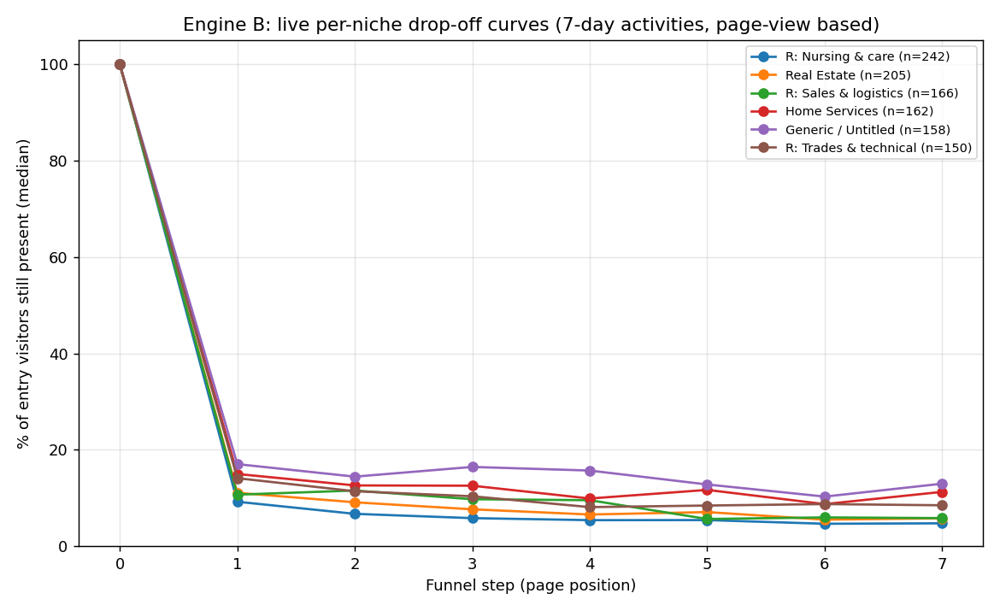 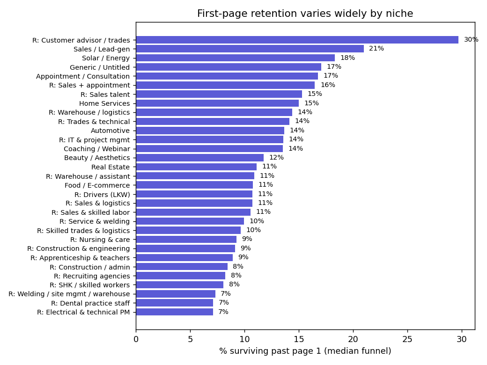

**The dominant finding: it's all the first page.** Median funnel keeps only **~10–17% of entry visitors past page 1**, then the curve is nearly flat — whoever clicks past the landing mostly continues. ~85–90% leave on the first page.

**Niche benchmark (median % surviving past page 1) — a 4× spread:**
- Worst: Electrical/PM recruiting 7.1%, Dental staff 7.1%, Welding 7.3%
- Best: Customer-advisor recruiting 29.7%, Sales/Lead-gen 21.0%, Solar 18.3%, Appointment/Consultation 16.8%

**This reframes the product into two distinct levers:**
1. **Landing-page click-through (volume lever):** by far the biggest, and it's where 85-90% of the loss is. The #1 thing to diagnose/fix.
2. **Post-engagement structure (quality lever):** Engine A's "winners ask more questions/branching" only acts on the ~10-17% who get past page 1 — it lifts *their* conversion, not the volume cliff.

A funnel can be weak on either axis, and the fix differs. The engine should report both: "your page-1 retention (8%) is below your niche median (12%) — fix the landing" vs "your retention is fine but you under-qualify vs winners — add form questions."

**Caveats:** page-view *events* (not distinct sessions — back-nav inflates slightly); 7-day window; only 32% of event rows joined to a snapshot page (versionId/slug mismatches + sub-200-visitor versions) → 3,265 funnels with stable curves; the entry-page event likely includes cold-traffic bounces, so the page-1 cliff partly reflects traffic quality, not only design — the *niche variation* is the design-relevant signal. Refine: distinct-session counts + wider window via the prod-safe activities aggregation.

## 14. The REAL structural learning — landing-page composition & sequence (within-niche, 107,690 funnels)

Going beyond scalar counts (which is all the 2021 IBB study + our §12 used) to **composition and placement**. A coherent, non-obvious winning pattern emerged — consistent across most of the 32 niches:

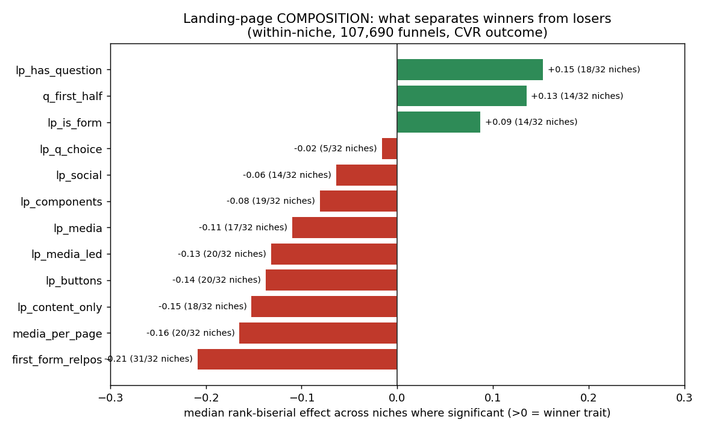

**The winning funnel-design pattern:**
1. **Open with a question, not a landing page.** `lp_has_question` is a winner trait in 18/32 niches (median loser→winner = **0%→100%** — winners' page 1 *is* an interactive question). Mirror image: static content-only landings (`lp_content_only` −0.15) and hero-media landings (`lp_media_led` −0.13, 20/32) are *loser* traits.
2. **Keep the first page lean.** Winners' landing pages have *less* media (−0.11), *fewer* CTAs/buttons (−0.14), *fewer* components — `media_per_page` −0.16 across 20/32 niches. Clutter loses.
3. **Front-load the questions.** `q_first_half` +0.13 (14/32) — winners put engagement early.
4. **Don't bury the form** — the most universal trait (31/32 niches). Winners reach the first form at ~**1/3 through** the funnel; losers bury it at the **middle (~0.50)**.

**In one sentence:** *winning funnels open with a lean, interactive question — not a hero-image landing page — front-load engagement, and reach the form in the first third.* That's a concrete design rule a builder can apply, and it's the opposite of the conventional "hero image + headline + CTA" landing template.

**Why this is the real learning (vs §12 and the 2021 study):** it's *compositional and sequential*, not "add more X." It explains the page-1 cliff (a question engages immediately; a static hero lets cold traffic bounce). And it differs by niche in the expected ways (Beauty still wants minimal media; visual roles tolerate more).

**Caveats:** `first_form_relpos` is partly mechanical (CVR = form submission, so an earlier form is reached by more visitors) — real and actionable ("don't bury your form"), but not purely a design effect. "Open with a question" / "lean landing" are *not* mechanical. Still observational → validate via `campaign_ab_tests`. Next layer: **content × component** (does the *copy style* on that first question matter?) and page-archetype **sequence motifs**.

## 15. Content × component — and is the Funnel Score even feasible? (107,690 funnels)

Predicting **within-niche CVR percentile** (the target strips out the 87% niche confound) from design, 5-fold CV, HistGBM, Spearman(pred, actual):

| Model | Spearman ρ |
|---|---|
| niche only (baseline) | −0.05 (≈0, as expected) |
| + **structure** (composition features) | **0.264** |
| + **content** (copy embedding, 50-dim) | **0.303** |
| + **structure + content** | **0.370** |

**Three real conclusions:**
1. **The Funnel Score is feasible.** Design predicts within-niche conversion ordering at **ρ=0.37** — close to the plan's V1 gate (0.40), and this is *within niche* (not the easy "dental beats cold-ecom" rediscovery). Richer features (full embedding, per-page sequence, archetypes) should clear 0.40.
2. **Content matters MORE than structure** (0.303 vs 0.264). The *copy* carries more signal than the layout. Strategic implication: the engine's biggest lever is messaging, not component arithmetic.
3. **They're complementary** — together (0.37) beats either alone; content adds +0.106 beyond structure, structure adds +0.067 beyond content. So "content × component" is real: both contribute independent signal. That's the answer to "how do they play hand in hand."

**Why this matters for the product:** it's the first hard evidence that a 0-traffic design score can meaningfully rank funnels within their niche — *and* that the recommendation engine must reason about copy, not just structure. It also sets the modeling target: push ρ past 0.40 with richer content + sequence features, then ship percentile-within-niche as the score.

**Caveat:** observational; ρ=0.37 means design explains a real-but-bounded slice of within-niche ordering (consistent with the 87/13 split — most variance is audience/traffic the builder can't control). The score is a *relative* design-quality signal, not a CVR oracle.

## 16. Block composition + sequence (design) and message angles (content)

### 16a. Page archetypes — which block-mix per page, in which order (page_archetypes.py)
Each page classified by dominant block mix: Qmedia / Qtext / Qchoice / FORM / content+media / content/text / result.

**Opening page → within-niche CVR percentile (50 = average):**
- Open with **FORM 55.9th** · Qmedia 51.3 · Qtext 51.1 · result 51.0 · Qchoice 49.6 · **content+media 47.0 · content/text 46.9 (worst)**

**First-3-page sequences:**
- **Winning (60–65th pct):** `Qchoice→content+media→FORM`, `FORM→Qmedia→content+media`, `Qtext→Qtext→FORM` — *interaction front-loaded.*
- **Losing:** static content stacks → `content+media→content+media→result` (30th); worst overall `content+media→result` (**7th pct** — hero page straight to thank-you, no interaction).

**Design rule (precise, compositional):** front-load interaction — open with a form or question, keep questions/forms in the first 3 pages; chaining static content/hero pages is the most reliable way to lose. Explains the page-1 cliff (static hero = nothing to do = bounce). *Caveat: the worst 2-page static funnels are partly incomplete/placeholder funnels, not only bad design.*

### 16b. Winning message angles per niche (message_angles.py — copy clustered within niche)
- **Trades & technical:** "work in Germany / Netherlands" relocation framing → 3.5–7.0% vs ~1.9% local job ads
- **Coaching/Webinar:** *live* webinar 9.8% ≫ recorded video course 6.4% ≫ agency/Weiterbildung 1.9%
- **Real Estate:** investment / tax / retirement / income framing 3.8% > listing/exposé pages 1.4%
- **Nursing & care:** development/Ausbildung framing ~1.9% > "Dr./practice" context 0.7%
- **Solar:** "free quote, we'll call you" 3.3% > "PV-Anlage Angebot" 1.7%

*Caveat: the English "abroad" angles also attract a different, more motivated audience — copy and audience are partly entangled; A/B (campaign_ab_tests) is the clean test.*

**Together (§14–16) = the playbook seed:** open with an interactive question/form on a lean page, front-load interaction, reach the form by ⅓, avoid static content stacks — and use the niche's winning message angle. Both structure and content carry independent signal (§15).

## 17. Causal layer — how often do tested changes actually win? (26,039 real A/B tests)

From `campaign_ab_tests` (483,864 entries → 58,335 distinct control/variant page pairs) + `split_test_ended` verdicts (`kept_original`).

**Headline: the challenger beats the original only ~41% of the time** (tests ran ≥1 day; 36.6% incl. 0-day tests). So **builders iterating by gut lose ~59% of their experiments.** Per niche it ranges 25% (Sales & logistics) → 53% (Sales+appointment).

**This is the product's core justification:** people A/B test blind and fail most of the time. An engine that raises the win-rate above 41% by steering changes toward what wins in their niche is directly, measurably valuable — and the flywheel (every test feeds the model) compounds it.

**What we can't yet do causally:** validate *which* structural changes win — only 2% of test pages are in our parsed snapshots (variant pages are newly created for the test). Validating specific playbook traits (e.g., "adding a form question causes lift") requires parsing the test pages themselves (the `pages` collection or per-version snapshots). Scoped as next step. Until then, §14–16 remain associational (winners *correlate* with these traits), and §17 proves only the *aggregate* that tested changes usually don't win.

## 18. CAUSAL result — what changes actually win real A/B tests (9,950 linked tests)

Recovered structure for 62,368 of 97,599 A/B-test pages (64%, via `components` collection by pageId). Linked each test's `testKey` (creation ms) to its `split_test_created` event (precise ms), chained to the next `ended` verdict → **9,950 tests with both pages' structure + a verdict** (8.5× the first fuzzy-join attempt, which was a biased small sample and is superseded).

**Challenger-win baseline 27% (most changes don't beat the original). Win-rate by change type:**
- more components +2pp · added CTA/media ~0 (neutral)
- removed media −5pp · added a question −5pp · removed a question −10pp
- **added input fields −16pp · added a form-question −16pp · removed a form-question −22pp** (form changes are by far the riskiest)

**The key learning — correlation vs causation, measured:**
- Observationally (§12/§14), winning funnels *have* more form questions and open with a question.
- Causally, when a builder *adds* a form question to a live funnel, it wins only ~11% of the time. Touching the form (add or remove) almost always loses.
- These aren't contradictory: good funnels were *built* rich and well-sequenced from the start; retrofitting components onto an existing funnel is a different thing and usually backfires.

**Product implication (this is the important one):** a naive engine that recommends "add a question / add a form field" straight from the §12–16 correlations would make customers' funnels *worse* in A/B tests. The descriptive score (what good funnels look like) is valid; converting it into change-recommendations is unsafe without causal validation. This is the Goodhart risk from the plan, now quantified — and the strongest argument for the A/B flywheel as a core component, not an afterthought.

**Caveats:** baseline 27% is subset-specific (vs 41% overall — linked tests skew to funnels with both pages parsed); change buckets are multi-variable (a "added a form-question" variant changed other things too); component counts are current-state. Directionally robust at n=9,950; per-niche causal tables need the wider linkage still.

## 19. Funnel Score clears the gate (ρ=0.48) + per-niche causal note

**Score v2 (score_v2.py)** — within-niche CVR percentile, full feature set, 5-fold CV:
- structure + composition + page-archetype: ρ=0.382
- content (120-dim embedding): ρ=0.396
- **all combined: ρ=0.480** — past the plan's 0.40 V1 gate. Structure and content are strongly complementary (0.48 vs 0.38/0.40 alone). The 0-traffic Funnel Score is feasible.

**Per-niche causal (per_niche_causal.py):** form-touching tests win 10% vs 28% for non-form changes (n=546) — the "don't touch the form" rule is robust in aggregate and holds in 2/3 measurable niches. But only 3 niches have ≥20 form-touch tests, and recruiting agencies bucked it (44% vs 20%). So no reliable per-niche form guidance yet; needs more linked tests.

## Artifacts produced

- `versions_dedup_v1` — deduped funnel snapshots (one row per `_id`)
- `funnel_agg_v1` — per-funnel behavior: visitors, CVR, completion, traffic mix (1.18M rows)
- `funnel_struct_v1` — per-funnel structure: n_pages, n_result_pages (funnels ≥200 visitors, 196K rows)
- `charts/` — 7 figures; `data/` — chart CSVs; `make_charts.py` — reproducible

*All queries are funnel-level on small aggregate tables, so re-running analysis is cheap. The two big scans of `sessions_v2` are already materialized.*
